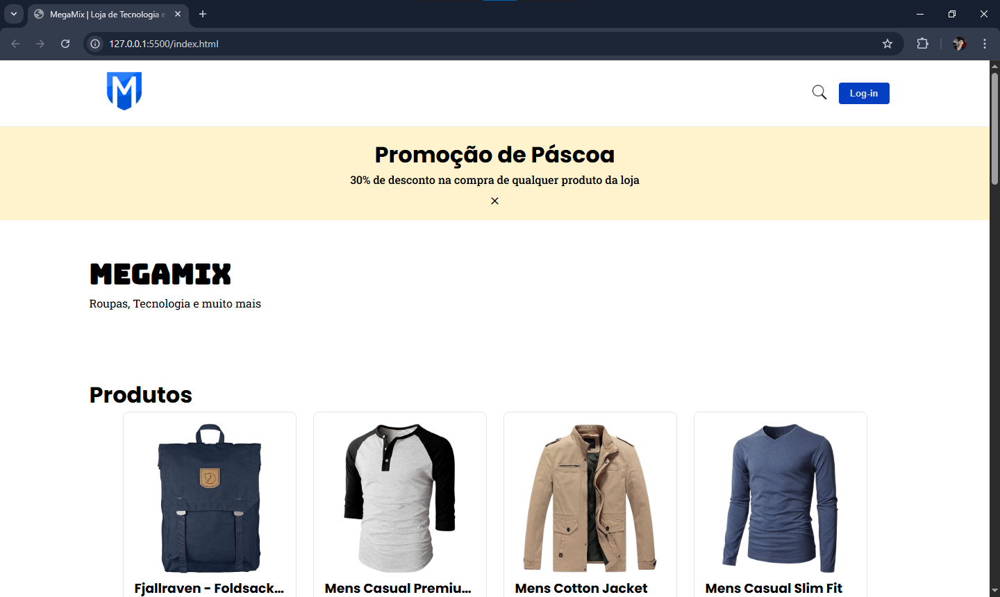

# TechStore — Loja Front-end



Projeto de **loja virtual front-end** desenvolvido com foco em **UX, organização de estado e boas práticas de JavaScript**, simulando um e-commerce moderno.

> 💡 Projeto ideal para portfólio, demonstrando domínio de DOM, estado global, modais, autenticação simulada e consumo de API.

---

## 🚀 Funcionalidades

* 📦 Listagem de produtos via API
* 🔍 Busca de produtos em tempo real
* 🪟 Modal de detalhes do produto
* 👤 Criação de conta (simulada)
* 🔐 Login persistente com `localStorage`
* 🧠 Gerenciamento de estado centralizado
* 🔔 Feedback visual (toast) no lugar de `alert()`
* ♿ Acessibilidade básica (ARIA, navegação por teclado)
* 📱 Layout responsivo

---

## 🧩 Tecnologias utilizadas

* **HTML5** (semântico)
* **CSS3** (Flexbox + Grid)
* **JavaScript (ES6+)**
* **Fake Store API** (dados de produtos)
* **LocalStorage** (persistência de usuário)

---

## 🗂️ Estrutura do projeto

```text
📁 src/
 ├── 📄 index.html
 ├── 🎨 style.css
 ├── ⚙️ script.js
 └── 📁 Images/
```

---

## 🧠 Organização de Estado

O projeto utiliza um objeto de estado centralizado:

```js
const state = {
  products: [],
  filtered: [],
  search: "",
  searchOpen: false,
  modalProduct: null,
  user: null,
  isLogged: false,
};
```

Isso permite:

* previsibilidade
* melhor manutenção
* renderização controlada da UI

---

## 🔐 Autenticação (Simulada)

* Criação de conta salva no `localStorage`
* Login validado localmente
* Sessão persistente após recarregar a página

⚠️ *Projeto apenas para fins educacionais (sem backend real).*

---

## 🔔 Feedback ao usuário

Todos os `alert()` foram substituídos por **toasts visuais**, garantindo:

* Melhor UX
* Interface não bloqueante
* Padrão de aplicações modernas

---

## ♿ Acessibilidade

* Uso de `aria-label`
* Controle por teclado (ESC fecha modal)
* Estados visuais claros

---

## 📦 API utilizada

Os produtos são consumidos da API pública:

```
https://fakestoreapi.com/products
```

---

## 🧪 Como rodar o projeto

1. Clone o repositório
2. Abra o arquivo `index.html` no navegador

> Não é necessário instalar dependências

---

## 👨‍💻 Autor

Desenvolvido por **Ernand Soares**

* 🔗 LinkedIn: *([Clique aqui](https://www.linkedin.com/in/ernand-soares-4453ba2bb/))*

---

⭐ Se você gostou do projeto, deixe uma estrela!
